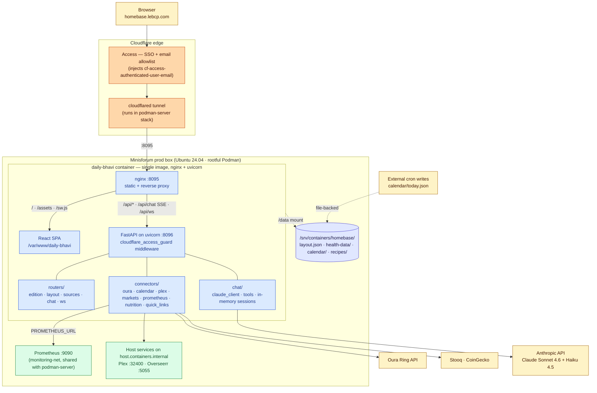

# homebase

The Daily Bhavi — a personal newspaper PWA at `homebase.lebcp.com`.

A FastAPI backend + Vite/React frontend, served by a single Podman container
(`daily-bhavi`) on the Minisforum prod box. Pulls live data from connectors
(Plex, Overseerr, Oura, calendar, markets, Prometheus, etc.) and renders it
as a three-column newspaper with a chat bar that can edit the layout.

Split out of [`podman-server`](https://github.com/bkpatel95/podman-server)
on 2026-05-13. Older history lives there.

## Architecture



Notes the diagram glosses over:

- **Auth.** Every `/api/*` request except `/api/health` runs through the
  `cloudflare_access_guard` middleware in `backend/app.py`, which trusts the
  `cf-access-authenticated-user-email` header set by Cloudflare Access and
  rejects anything not in `ALLOWED_EMAILS`. The nginx proxy passes that header
  through verbatim — see `nginx.conf`.
- **Chat sessions** are in-memory only (`backend/chat/session.py`), keyed by a
  client-supplied UUID in `localStorage` with idle expiry. There is no
  persistent chat-history store; restarting the container clears transcripts.
- **Model routing.** `chat/claude_client.py:pick_model()` routes pure
  layout-edit messages to Haiku 4.5 for cost; questions and analysis go to
  Sonnet 4.6. Claude calls layout tools that mutate `layout.json` on the
  volume, then the backend broadcasts an `edition_dirty` event over
  `/api/ws` so connected tabs refetch `/api/edition`.
- **Connectors** are uniform `Connector` subclasses (`backend/connectors/base.py`).
  Some hit external APIs directly (oura, markets, prometheus, plex); others
  read files dropped onto the `/data` volume by external cron jobs
  (calendar, the health-data summary, recipes).
- **monitoring-net** is created by the `podman-server` monitoring compose
  stack and joined here as an external network — see `deploy/docker-compose.yml`.
  If you stand this app up on a box without that stack, create the network
  (or a stand-in) first or the container won't start.

## Layout

```
backend/        FastAPI app — routers, connectors, chat tools
frontend/       Vite/React SPA — components, widgets, hooks
Dockerfile      Multi-stage build: node → python+nginx single image
nginx.conf      Serves /api/* → uvicorn:8096, everything else → /var/www
start.sh        Container entrypoint: nginx + uvicorn under tini
deploy/         docker-compose.yml + deploy.sh used on the Minisforum
skills/         Claude Code skills scoped to this repo (e.g. add-widget)
```

## Develop

The fastest path is the dockerized dev stack — one command, no Python or
Node installed locally, no real Plex/Oura/Overseerr tokens needed:

```bash
cp .env.example .env       # set ANTHROPIC_API_KEY; the rest is optional
make dev                   # http://localhost:3000 (frontend) → :8000 (backend)
```

`docker-compose.dev.yml` runs three containers:

- **backend** — uvicorn with `--reload`, source mounted from `./backend`
- **frontend** — vite dev server with HMR, source mounted from `./frontend`
- **postgres** — exposed on `:5433`, reserved for future chat-history
  persistence (Phase 4 in `backend/chat/session.py`)

The `/data` mount points at `dev/mock-data/`, so file-backed connectors
(calendar, Oura summary, prod-health, recipes) render with realistic
sample data out of the box. The calendar widget filters on today's date —
run `make dev-seed` to rewrite `dev/mock-data/calendar/today.json` with
today's date so the events actually show up. API connectors (Plex,
Overseerr, Oura API) gracefully render "not configured" if their tokens
are unset.

Common Make targets (run `make` for the full list):

| Target | What it does |
|---|---|
| `make dev` | Build + start the stack (foreground) |
| `make dev-down` | Stop and remove containers |
| `make dev-logs` | Tail logs from all containers |
| `make dev-seed` | Refresh mock calendar with today's date |
| `make dev-clean` | Stop AND wipe postgres + node_modules volumes |

### Without docker

If you'd rather run uvicorn and vite directly:

Backend (from repo root):

```bash
python -m venv .venv && source .venv/bin/activate
pip install -r backend/requirements.txt
uvicorn backend.app:app --reload --port 8096    # picks up env from your shell
```

Frontend (from `frontend/`):

```bash
npm install
npm run dev          # vite at :5173, proxies /api → :8096
```

Either way: missing `ANTHROPIC_API_KEY` makes the backend refuse to start
with a clear error (see `backend/config.py`). Missing optional integration
tokens (`OURA_TOKEN`, `PLEX_TOKEN`, `OVERSEERR_API_KEY`) just log a warning
at startup — those connectors render unavailable in the UI.

## Deploy

Auto-deploy is git-driven: prod runs whatever is on `origin/main`.

```bash
ssh bp@100.91.251.82 'cd ~/homebase/deploy && ./deploy.sh'
```

`deploy.sh`:
1. Refuses if the prod working tree is dirty.
2. `git fetch + checkout main + pull --ff-only origin main`.
3. Computes `BUILD_VERSION=<short-sha>-<utc-timestamp>` and exports it.
4. Builds + recreates `daily-bhavi` via `podman-compose`.
5. Polls health for 180s, curls `/api/health`, exits non-zero on failure.

The `BUILD_VERSION` arg flows into the Dockerfile, which stamps it into
`sw.js` so the service worker cache key rotates on every deploy.

## Prod paths

| Thing | Path |
|---|---|
| Repo on prod | `~/homebase/` (Tailscale IP `100.91.251.82`, user `bp`) |
| `.env` (gitignored, chmod 600) | `~/homebase/deploy/.env` |
| Container data volume | `/srv/containers/homebase/` |
| Host port | `8095` (cloudflared maps homebase.lebcp.com → :8095) |
| Image tag | `localhost/homebase:local` |

## Service worker / cache

App-shell cache name: `daily-bhavi-shell-<BUILD_VERSION>`. The activate
handler deletes any cache whose name doesn't match the new one, so every
deploy invalidates the prior shell. Nginx serves `/sw.js` with
`Cache-Control: no-cache`, so browsers always re-fetch it.

If a deploy isn't showing in the browser:

```bash
curl http://localhost:8095/build-info.json     # confirm server has the new SHA
curl http://localhost:8095/sw.js | grep CACHE  # confirm new BUILD_VERSION
```

If the server is right but the client is stale: hard-refresh (Cmd+Shift+R),
or DevTools → Application → Service Workers → Unregister.
